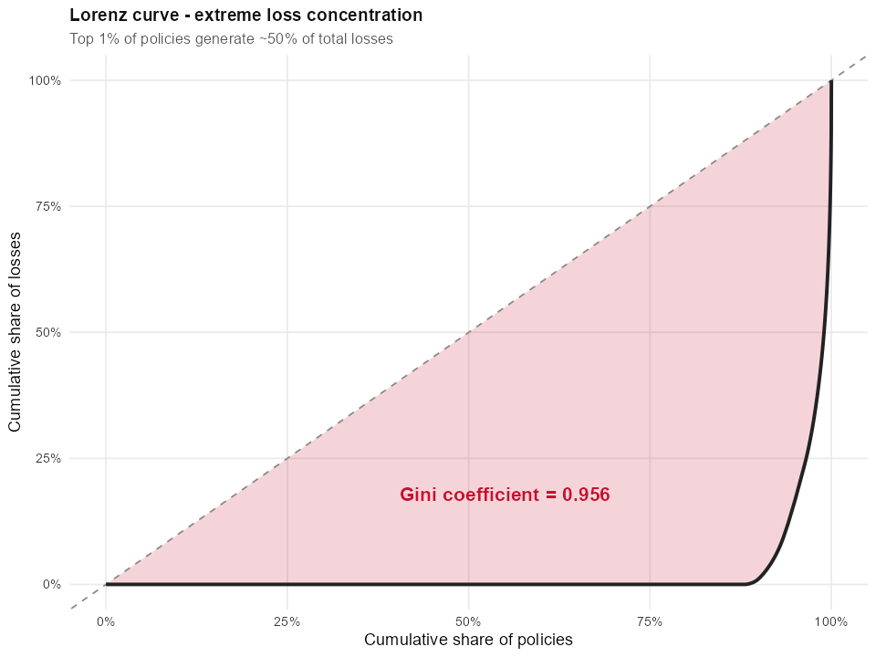

```{=html}
<style>
:root {
  --primary: #111111;
  --accent: #C8102E;
  --text: #1a1a1a;
  --muted: #666666;
  --border: #e5e5e5;
}

/* ===== HERO ===== */
.home-hero {
  background: linear-gradient(135deg, #fafafa 0%, #ffffff 100%);
  padding: 5rem 2rem 4rem;
  margin: -1.5rem -1rem 4rem;
  position: relative;
  overflow: hidden;
  border-bottom: 1px solid var(--border);
}
.home-hero::before {
  content: "";
  position: absolute; inset: 0;
  background-image:
    linear-gradient(115deg, transparent 60%, rgba(0,0,0,.025) 60.5%, transparent 61%),
    linear-gradient(75deg, transparent 70%, rgba(0,0,0,.02) 70.5%, transparent 71%),
    linear-gradient(165deg, transparent 40%, rgba(0,0,0,.018) 40.3%, transparent 40.5%);
  pointer-events: none;
}
.home-hero-content { position: relative; max-width: 900px; padding: 0 1rem; }
.home-hero h1 {
  font-family: 'Oswald', sans-serif;
  font-weight: 700;
  font-size: 4rem;
  line-height: 0.95;
  letter-spacing: 0.02em;
  text-transform: uppercase;
  color: var(--primary);
  margin: 0;
  border: none;
}
.home-hero .lead {
  font-family: 'Inter', sans-serif;
  font-size: 1.15rem;
  color: var(--muted);
  line-height: 1.55;
  margin: 0;
  max-width: 700px;
}
.accent-line {
  height: 4px; width: 80px;
  background: var(--accent);
  margin: 1.5rem 0;
}
.home-hero .by {
  font-family: 'Oswald', sans-serif;
  font-size: 0.75rem;
  letter-spacing: 0.2em;
  text-transform: uppercase;
  color: var(--muted);
  margin-top: 2rem;
}

/* ===== SECTION ===== */
.home-section { padding: 0 1rem; margin-bottom: 4rem; }
.section-label {
  font-family: 'Oswald', sans-serif;
  font-size: 0.8rem;
  letter-spacing: 0.25em;
  text-transform: uppercase;
  color: var(--accent);
  font-weight: 600;
  margin-bottom: 0.3rem;
}
.section-title {
  font-family: 'Oswald', sans-serif;
  font-size: 2rem;
  letter-spacing: 0.02em;
  text-transform: uppercase;
  font-weight: 700;
  color: var(--primary);
  border-bottom: 3px solid var(--primary);
  padding-bottom: 0.4rem;
  margin: 0 0 2rem;
}

/* ===== FEATURED CARD ===== */
.featured-card {
  background: white;
  border: 1px solid var(--border);
  padding: 2.5rem;
  display: grid;
  grid-template-columns: 3fr 2fr;
  gap: 3rem;
  align-items: center;
  transition: transform .25s, box-shadow .25s;
}
.featured-card:hover {
  transform: translateY(-2px);
  box-shadow: 0 8px 24px rgba(0,0,0,.08);
}
.featured-card .label {
  font-family: 'Oswald', sans-serif;
  font-size: 0.75rem;
  letter-spacing: 0.2em;
  text-transform: uppercase;
  color: var(--accent);
  font-weight: 600;
}
.featured-card h3 {
  font-family: 'Oswald', sans-serif;
  font-size: 2rem;
  letter-spacing: 0.02em;
  color: var(--primary);
  margin: 0.4rem 0 1rem;
  font-weight: 700;
  border: none;
  line-height: 1.1;
}
.featured-card p { color: #333; line-height: 1.6; margin-bottom: 1rem; }
.featured-card ul { list-style: none; padding: 0; margin: 1rem 0 2rem; }
.featured-card ul li {
  padding: 0.35rem 0 0.35rem 1.5rem;
  position: relative;
  color: #333;
  font-size: 0.95rem;
}
.featured-card ul li::before {
  content: "—";
  position: absolute; left: 0;
  color: var(--accent);
  font-weight: 700;
}

/* ===== BUTTONS ===== */
.btn-pri, .btn-out {
  display: inline-block;
  padding: 0.7rem 1.4rem;
  font-family: 'Oswald', sans-serif;
  font-size: 0.85rem;
  letter-spacing: 0.1em;
  text-transform: uppercase;
  font-weight: 600;
  text-decoration: none !important;
  border: 2px solid var(--primary);
  transition: all .2s;
  margin-right: 0.4rem;
}
.btn-pri { background: var(--primary); color: white !important; }
.btn-pri:hover { background: var(--accent); border-color: var(--accent); }
.btn-out { background: transparent; color: var(--primary) !important; }
.btn-out:hover { background: var(--primary); color: white !important; }

/* ===== HANDS-ON GRID ===== */
.hands-on-grid {
  display: grid;
  grid-template-columns: repeat(auto-fit, minmax(210px, 1fr));
  gap: 1.5rem;
}
.ex-card {
  background: white;
  border: 1px solid var(--border);
  border-top: 4px solid var(--primary);
  padding: 1.8rem 1.5rem 2.5rem;
  text-decoration: none !important;
  color: var(--text) !important;
  display: block;
  transition: transform .25s, box-shadow .25s, border-top-color .25s;
  position: relative;
}
.ex-card:hover {
  transform: translateY(-4px);
  box-shadow: 0 8px 24px rgba(0,0,0,.08);
  border-top-color: var(--accent);
}
.ex-card .num {
  font-family: 'Oswald', sans-serif;
  font-size: 0.75rem;
  letter-spacing: 0.2em;
  color: var(--muted);
  text-transform: uppercase;
}
.ex-card .num strong { color: var(--accent); font-weight: 700; font-size: 1.4em; }
.ex-card h4 {
  font-family: 'Oswald', sans-serif;
  font-size: 1.1rem;
  color: var(--primary);
  margin: 0.5rem 0 0.8rem;
  font-weight: 700;
  line-height: 1.2;
  text-transform: uppercase;
  letter-spacing: 0.02em;
}
.ex-card p { font-size: 0.85rem; color: var(--muted); line-height: 1.5; margin: 0; }
.ex-card .arrow {
  position: absolute;
  right: 1.5rem; bottom: 1.2rem;
  color: var(--muted);
  font-size: 1.3rem;
  transition: color .2s, transform .2s;
}
.ex-card:hover .arrow { color: var(--accent); transform: translateX(4px); }

/* ===== FOOTER ===== */
.home-footer {
  background: #f5f5f5;
  padding: 2.5rem 2rem;
  margin: 4rem -1rem -1.5rem;
  text-align: center;
  border-top: 1px solid var(--border);
}
.home-footer p {
  color: var(--muted);
  font-size: 0.85rem;
  margin: 0.3rem 0;
  font-family: 'Inter', sans-serif;
}
.home-footer strong {
  font-family: 'Oswald', sans-serif;
  letter-spacing: 0.1em;
  text-transform: uppercase;
  color: var(--primary);
}

/* ===== Responsive ===== */
@media (max-width: 900px) {
  .featured-card { grid-template-columns: 1fr; gap: 2rem; }
  .home-hero h1 { font-size: 2.5rem; }
}
</style>

<div class="home-hero">
  <div class="home-hero-content">
    <h1>VISUAL ANALYTICS<br/>& APPLICATIONS</h1>
    <div class="accent-line"></div>
    <p class="lead">A coursework portfolio exploring <strong>the grammar of graphics</strong>, statistical visualisation and interactive data exploration with R, ggplot2 and Quarto.</p>
    <p class="by">ISSS608 · MITB · Singapore Management University</p>
  </div>
</div>

<div class="home-section">
  <div class="section-label">★ Featured Project</div>
  <h2 class="section-title">Take-home Exercise 1</h2>
  <div class="featured-card">
    <div>
      <div class="label">Visual Analytics Case Study</div>
      <h3>Motor Insurance<br/>Portfolio Review</h3>
      <p>A visual-analytics study of a real-world Spanish motor-insurance portfolio — <strong>354,000 records · 47 variables · 2022–2024</strong> — investigating drivers of profitability and volatility.</p>
      <ul>
        <li><strong>COMP-N policies</strong> crossed 100% Loss Ratio in 2024</li>
        <li><strong>Cancelled policies</strong> run a 128% LR vs Active's 64% — adverse retention</li>
        <li><strong>Gini = 0.956</strong> — top 1% of policies generate ~50% of losses</li>
        <li>The deterioration is a <strong>pricing</strong> story, not a loss-cost story</li>
      </ul>
      <p style="margin-top: 1.5rem;">
        <a href="Take-home_Ex/Take-home_Ex01/index.html" class="btn-pri">Technical Report →</a>
        <a href="Take-home_Ex/Take-home_Ex01/exec_summary.html" class="btn-out">Executive Summary →</a>
      </p>
    </div>
    <div>
      
      <p style="font-size:0.78em;color:#888;text-align:center;font-style:italic;margin-top:0.5em;">Lorenz curve of incurred losses · Gini = 0.956</p>
    </div>
  </div>
</div>

<div class="home-section">
  <div class="section-label">⚒ Weekly Practice</div>
  <h2 class="section-title">Hands-on Exercises</h2>
  <div class="hands-on-grid">
    <a class="ex-card" href="Hands-on_Ex/Hands-on_Ex01/index.html">
      <div class="num">Exercise <strong>01</strong></div>
      <h4>ggplot2 Basics</h4>
      <p>The grammar of graphics — geoms, aesthetics, scales and themes.</p>
      <span class="arrow">→</span>
    </a>
    <a class="ex-card" href="Hands-on_Ex/Hands-on_Ex02/index.html">
      <div class="num">Exercise <strong>02</strong></div>
      <h4>Beyond ggplot2</h4>
      <p>Annotations, faceting and the ggplot2 extension ecosystem.</p>
      <span class="arrow">→</span>
    </a>
    <a class="ex-card" href="Hands-on_Ex/Hands-on_Ex03/index.html">
      <div class="num">Exercise <strong>03</strong></div>
      <h4>Interactive Data Visualisation</h4>
      <p>Bringing graphics to life with plotly, ggiraph and crosstalk.</p>
      <span class="arrow">→</span>
    </a>
    <a class="ex-card" href="Hands-on_Ex/Hands-on_Ex04/index.html">
      <div class="num">Exercise <strong>04</strong></div>
      <h4>Distribution, Uncertainty & Statistics</h4>
      <p>Funnel plots and statistical visualisation with ggdist & ggstatsplot.</p>
      <span class="arrow">→</span>
    </a>
    <a class="ex-card" href="Hands-on_Ex/Hands-on_Ex05/index.html">
      <div class="num">Exercise <strong>05</strong></div>
      <h4>Multivariate Data</h4>
      <p>Visualising correlations, clusters and high-dimensional structure.</p>
      <span class="arrow">→</span>
    </a>
  </div>
</div>

<div class="home-footer">
  <p><strong>ISSS608 Visual Analytics & Applications</strong></p>
  <p>Built with Quarto · 2026</p>
</div>
```